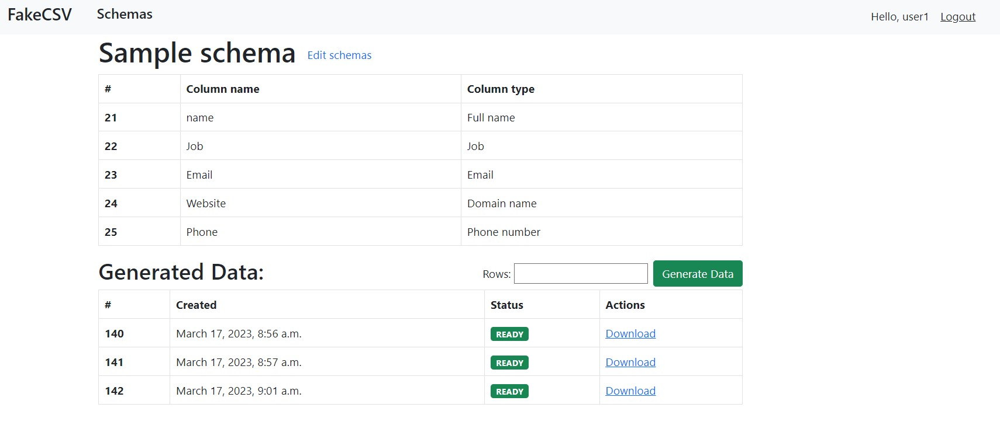

# Online Service for Generating CSV Files with Fake Data

This is a web-based service that allows users to generate CSV files with fake data using Python and Django.

## Features

* User authentication: users can log in to the system with a username and password.
* Data schema creation: any logged-in user can create any number of data schemas to create datasets with fake data.
* Different types of data: the service supports at least 5 different types of data, including full name, job, email, domain name, phone number, company name, text, integer, address, and date.
* Column configuration: users can build the data schema with any number of columns of any type and configure each column's name and order.
* Generation of fake data: after creating the schema, the user can input the number of records needed to generate and press the “Generate data” button.
* Generation status: the interface shows a colored label of the generation status for each dataset (processing/ready).
* Download button: a “Download” button is added for datasets available for download.

## Installation and Setup

```shell
clone repo: git clone https://github.com/Kev1nXD/Fake-CSV.git
change dir: cd Fake-CSV
make evn: python3 -m venv venv
activate env: venv\Scripts\activate
install requirements: pip install -r requirements.txt
run migrations: python manage.py migrate
create user: python manage.py createsuperuser
run server: python manage.py runserver
```

## Demo


